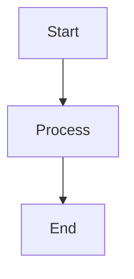

# Creature Server Documentation

Welcome to the Creature Server documentation!

## Available Documentation

### Architecture & Features

- **[Cooperative Animation Scheduler](cooperative-scheduler.md)** - Frame-by-frame animation scheduling with real-time interrupts and interactive control

## Quick Links

- [Main Project README](../README.md)
- [CLAUDE.md - AI Assistant Guidelines](../CLAUDE.md)
- [Source Code](../src/)

## Contributing to Documentation

Documentation is written in Markdown and stored in this `docs/` directory.

### Mermaid Diagrams

We use [Mermaid](https://mermaid.js.org/) for diagrams, which GitHub renders natively. Simply use Mermaid code blocks:

````markdown

````

### Code References

When referencing code locations, use relative links from the docs directory:

```markdown
See [SessionManager.h](../src/server/animation/SessionManager.h) for implementation details.
```
