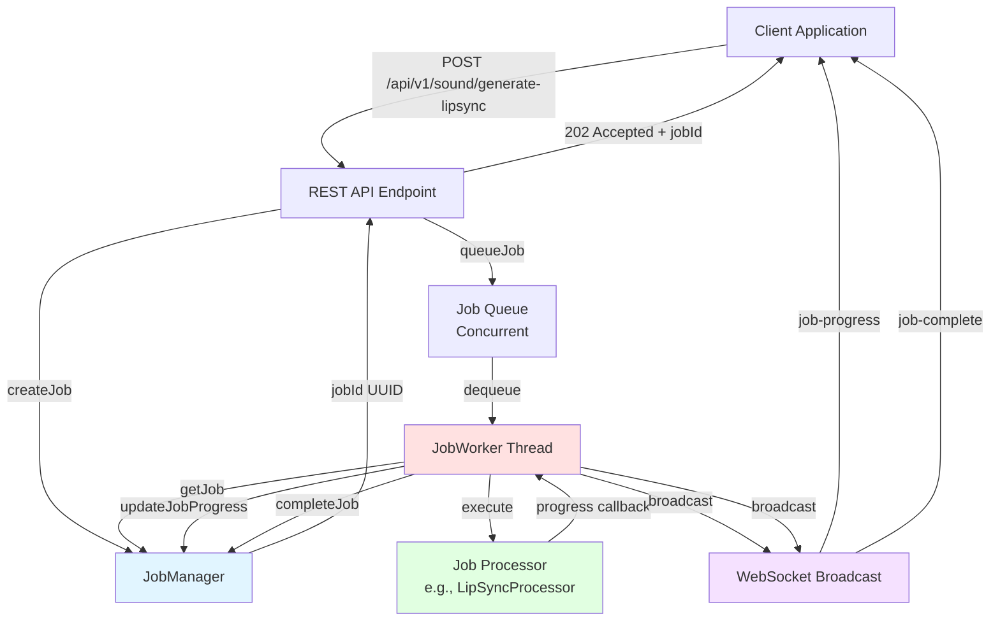
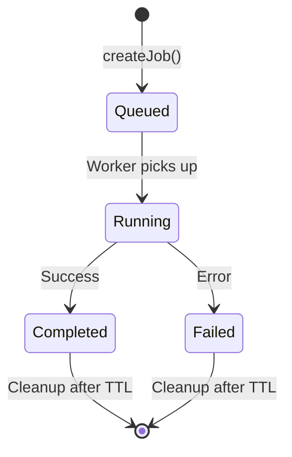
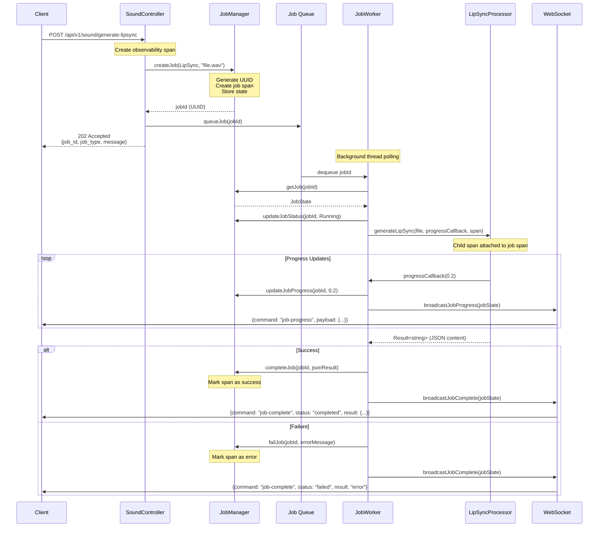

# Async Job System

## Overview

The async job system provides a framework for executing long-running operations in the background without blocking API requests. Jobs are queued, processed by a dedicated worker thread, and communicate progress and completion status to clients via WebSocket messages.

**Key Benefits:**
- Non-blocking API endpoints - return immediately with a job ID
- Real-time progress updates via WebSocket
- CPU-intensive operations don't interfere with the 1ms event loop
- Full observability tracing with parent-child span waterfalls
- Scalable architecture for adding new job types

## Architecture



## Components

### JobManager (`src/server/jobs/JobManager.{h,cpp}`)

Manages job state and lifecycle. Thread-safe singleton-style shared instance.

**Responsibilities:**
- Generate unique job IDs (UUIDs)
- Store job state in memory
- Track job status, progress, and results
- Create observability spans for each job
- Clean up old completed jobs

**Key Methods:**
```cpp
std::string createJob(JobType type, const std::string &details);
std::optional<JobState> getJob(const std::string &jobId);
void updateJobStatus(const std::string &jobId, JobStatus status);
void updateJobProgress(const std::string &jobId, float progress);
void completeJob(const std::string &jobId, const std::string &result);
void failJob(const std::string &jobId, const std::string &errorMessage);
```

### JobWorker (`src/server/jobs/JobWorker.{h,cpp}`)

Background thread (extends `StoppableThread`) that processes jobs one at a time.

**Responsibilities:**
- Poll the job queue for work
- Retrieve job state from JobManager
- Dispatch to appropriate handler based on `JobType`
- Update progress and broadcast to WebSocket clients
- Handle errors and mark jobs as failed

**Processing Loop:**
```cpp
while (!stop_requested) {
    if (queue.dequeue(jobId, timeout)) {
        processJob(jobId);  // Dispatches based on JobType
    }
}
```

### JobState (`src/server/jobs/JobState.h`)

Represents the state of a background job.

**Fields:**
- `jobId` - Unique identifier (UUID)
- `jobType` - Enum: `LipSync`, etc.
- `status` - Enum: `Queued`, `Running`, `Completed`, `Failed`
- `progress` - Float 0.0 to 1.0
- `result` - JSON result or error message
- `details` - Job-specific details (e.g., filename)
- `span` - Observability span for the entire job lifecycle

**Job Lifecycle:**


### LipSyncProcessor (`src/server/voice/LipSyncProcessor.{h,cpp}`)

Business logic for generating lip sync data using Rhubarb Lip Sync.

**Key Features:**
- Extracted from `SoundService` for reusability
- Static methods for stateless operation
- Progress callbacks for async updates
- Observability spans for each phase
- Error handling with `Result<T>` types

**Phases:**
1. Validate sound file exists and is WAV
2. Check for transcript file
3. Build and execute Rhubarb command
4. Read and process JSON output
5. Return result or error

## Job Flow



## WebSocket Messages

### Job Progress
```json
{
  "command": "job-progress",
  "payload": {
    "job_id": "550e8400-e29b-41d4-a716-446655440000",
    "job_type": "lip-sync",
    "status": "running",
    "progress": 0.65,
    "details": "audio.wav"
  }
}
```

### Job Complete
```json
{
  "command": "job-complete",
  "payload": {
    "job_id": "550e8400-e29b-41d4-a716-446655440000",
    "job_type": "lip-sync",
    "status": "completed",
    "result": "{\"metadata\":{\"soundFile\":\"audio.wav\"...}}",
    "details": "audio.wav"
  }
}
```

## Observability

Each job creates a parent span when created, and all operations during job execution create child spans from this parent, resulting in a waterfall visualization:

```
Job.lip-sync (parent span - entire job lifecycle)
├── LipSyncProcessor.generateLipSync
│   ├── LipSyncProcessor.validateSoundFile
│   ├── LipSyncProcessor.executeRhubarb
│   └── LipSyncProcessor.readAndProcessJson
```

**Span Attributes:**
- `job.id` - Unique job identifier
- `job.type` - Type of job
- `job.status` - Current or final status
- `job.progress` - Progress value
- `sound.file` - File being processed
- `rhubarb.exit_code` - Rhubarb process exit code
- `json.output_size` - Size of generated JSON

## Adding New Job Types

To add a new job type:

1. **Add enum value** to `JobType` in `JobState.h`
   ```cpp
   enum class JobType {
       LipSync,
       YourNewType  // Add here
   };
   ```

2. **Update `toString()` function** in `JobState.h`
   ```cpp
   case JobType::YourNewType:
       return "your-new-type";
   ```

3. **Create processor class** (e.g., `YourNewTypeProcessor.{h,cpp}`)
   - Follow the pattern of `LipSyncProcessor`
   - Use progress callbacks for updates
   - Create child spans for operations

4. **Add handler** in `JobWorker::processJob()`
   ```cpp
   case JobType::YourNewType:
       handleYourNewTypeJob(jobState);
       break;
   ```

5. **Create API endpoint** to queue the job
   ```cpp
   std::string jobId = jobManager->createJob(JobType::YourNewType, details);
   jobWorker->queueJob(jobId);
   return 202 with jobId;
   ```

## Configuration

Jobs are processed one at a time to avoid overwhelming the system. This is important because:
- Long-running operations (like Rhubarb) are CPU-intensive
- Must not interfere with the 1ms event loop
- Simpler to reason about resource usage

**Future Enhancement:** Could add a priority queue or multiple worker threads for different job types.

## Error Handling

Jobs can fail at any stage. The system handles errors by:
1. Catching exceptions in `JobWorker::processJob()`
2. Calling `JobManager::failJob()` with error message
3. Broadcasting failure to WebSocket clients
4. Setting error on observability span

Clients receive the same `job-complete` message structure with:
- `status: "failed"`
- `result: "error message"`

## Cleanup

Completed and failed jobs remain in memory for a configurable TTL (default: 1 hour). The `JobManager::cleanupOldJobs()` method can be called periodically to remove stale jobs.

**Future Enhancement:** Could trigger cleanup via an event loop task or integrate with MongoDB for persistent job history.

## Thread Safety

- **JobManager** uses `std::mutex` to protect the jobs map
- **Job Queue** uses `moodycamel::BlockingConcurrentQueue` (lock-free)
- **WebSocket broadcasts** use the existing `websocketOutgoingMessages` queue

## Files Created/Modified

### New Files
- `src/server/jobs/JobState.h` - Job state definitions
- `src/server/jobs/JobManager.{h,cpp}` - Job lifecycle management
- `src/server/jobs/JobWorker.{h,cpp}` - Background worker thread
- `src/server/voice/LipSyncProcessor.{h,cpp}` - Extracted business logic
- `src/util/uuidUtils.{h,cpp}` - UUID generation utility
- `src/server/ws/dto/JobProgressDto.h` - DTO for progress updates
- `src/server/ws/dto/JobCompleteDto.h` - DTO for completion messages
- `src/server/ws/dto/JobCreatedDto.h` - DTO for job creation response
- `src/server/ws/dto/websocket/JobProgressMessage.h` - WebSocket message wrapper
- `src/server/ws/dto/websocket/JobCompleteMessage.h` - WebSocket message wrapper

### Modified Files
- `src/server/main.cpp` - Wire up JobManager and JobWorker
- `src/server/ws/controller/SoundController.h` - Changed to async endpoint
- `src/server/ws/dto/websocket/MessageTypes.{h,cpp}` - Added new message types
- `src/util/websocketUtils.{h,cpp}` - Added broadcast functions
- `CMakeLists.txt` - Added new source files

## Future Enhancements

1. **Rhubarb Machine-Readable Mode** - Parse JSON progress output for more granular updates
2. **Job Cancellation** - Allow clients to cancel running jobs
3. **Job History** - Persist jobs to MongoDB with TTL index
4. **Priority Queue** - Different priority levels for job types
5. **Multiple Workers** - Parallel processing for different job types
6. **Job Dependencies** - Chain jobs together
7. **Retry Logic** - Automatic retry on transient failures
8. **Rate Limiting** - Limit job creation per client
