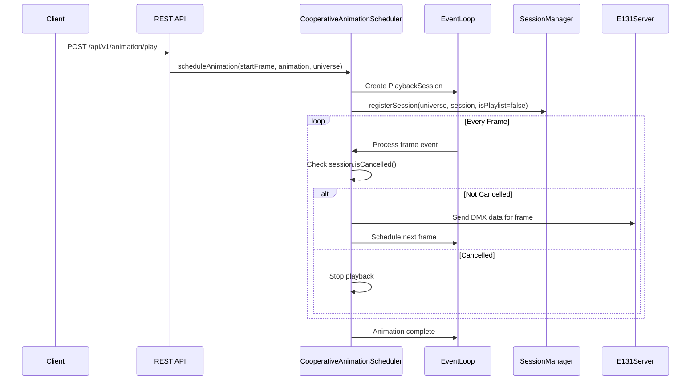
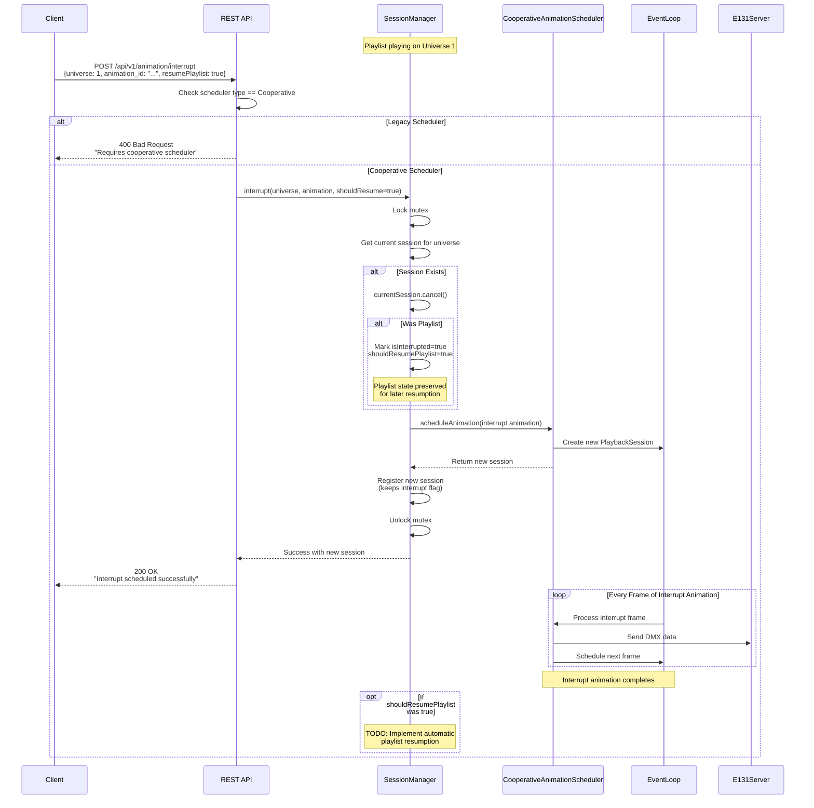

# Cooperative Animation Scheduler

The Cooperative Animation Scheduler is an experimental frame-by-frame animation playback system that enables advanced features like real-time interrupts and interactive animation control.

## Table of Contents

- [Overview](#overview)
- [Architecture](#architecture)
- [How It Works](#how-it-works)
- [Interrupt System](#interrupt-system)
- [Usage](#usage)
- [API Reference](#api-reference)
- [Observability](#observability)

## Overview

The cooperative scheduler provides an alternative to the legacy bulk event scheduling system. Instead of scheduling all animation frames at once, it plays animations frame-by-frame, checking for cancellation signals between each frame. This enables:

- **Real-time Interrupts**: Immediately cancel current playback to play a different animation
- **Playlist Management**: Track and resume interrupted playlists
- **Interactive Control**: Respond to user input during playback (e.g., button presses during Zoom meetings)
- **Fine-grained Telemetry**: Per-frame observability and tracing

### Legacy vs. Cooperative Scheduler

| Feature | Legacy Scheduler | Cooperative Scheduler |
|---------|-----------------|----------------------|
| **Scheduling** | Bulk event scheduling upfront | Frame-by-frame with event loop |
| **Cancellation** | Difficult - events already queued | Instant - checked every frame |
| **Interrupts** | Not supported | Full support |
| **Playlist Resume** | Not supported | Supported |
| **Memory Usage** | Higher (all events in queue) | Lower (one frame at a time) |
| **Stability** | Production-tested | Experimental |

## Architecture

The cooperative scheduler consists of three main components:

### 1. CooperativeAnimationScheduler

Handles frame-by-frame animation playback by scheduling individual frames with the event loop.

**Location**: `src/server/animation/CooperativeAnimationScheduler.h`

**Key Method**: `scheduleAnimation(startFrame, animation, universe)`

### 2. SessionManager

Centralized registry for tracking active playback sessions across all universes.

**Location**: `src/server/animation/SessionManager.h`

**Key Features**:
- Thread-safe session tracking with `std::mutex`
- Interrupt handling with playlist state preservation
- Resume capability for interrupted playlists
- Full OpenTelemetry instrumentation

### 3. PlaybackSession

State container for active animation playback with atomic cancellation flag.

**Location**: `src/server/animation/PlaybackSession.h`

**Key Features**:
- Atomic `cancelled_` flag for thread-safe cancellation checks
- Frame count tracking
- Immutable animation reference

## How It Works

### Normal Animation Playback Flow



### Interrupt Flow with Playlist Resume



## Interrupt System

### How Interrupts Work

1. **Immediate Cancellation**: The `SessionManager` calls `cancel()` on the current `PlaybackSession`, setting its atomic `cancelled_` flag
2. **Frame-by-Frame Check**: The cooperative scheduler checks `isCancelled()` before processing each frame
3. **State Preservation**: If interrupting a playlist, the `SessionManager` preserves:
   - Playlist ID
   - Current playlist index
   - Resume preference (from client)
4. **New Animation Scheduling**: The interrupt animation is immediately scheduled on the same universe
5. **Session Registration**: The new interrupt session is registered, keeping the interrupted state for potential resumption

### Thread Safety

All operations on `SessionManager` are protected by a `std::mutex`, ensuring thread-safe access from:
- Event loop thread (frame processing)
- WebSocket handler threads (REST API calls)
- Multiple concurrent interrupt requests

The `PlaybackSession.cancelled_` flag uses `std::atomic<bool>` for lock-free cancellation checks in the hot path (every frame).

## Usage

### Enabling the Cooperative Scheduler

Start the server with the cooperative scheduler:

```bash
./creature-server --scheduler cooperative
```

Or use the legacy scheduler (default):

```bash
./creature-server --scheduler legacy
```

### Quick Testing

Use the provided test script to quickly test interrupts:

```bash
# List available animations and show usage
./docs/test-interrupt.sh

# Interrupt universe 1 with an animation (no playlist resume)
./docs/test-interrupt.sh 507f1f77bcf86cd799439011

# Interrupt universe 1 and resume playlist after
./docs/test-interrupt.sh 507f1f77bcf86cd799439011 1 true

# Interrupt universe 2
./docs/test-interrupt.sh 507f1f77bcf86cd799439011 2
```

The script will:
1. ✓ Verify the animation exists
2. ✓ Send the interrupt request
3. ✓ Display color-coded results
4. ✓ Pretty-print JSON (if `jq` is installed)

### Interrupt API Endpoint

**Endpoint**: `POST /api/v1/animation/interrupt`

**Request Body**:
```json
{
  "animation_id": "507f1f77bcf86cd799439011",
  "universe": 1,
  "resumePlaylist": true
}
```

**Parameters**:
- `animation_id` (required): MongoDB ObjectID of the animation to play
- `universe` (required): Universe number to interrupt (1-63999)
- `resumePlaylist` (optional, default: false): Whether to automatically resume playlist after interrupt

**Success Response** (200):
```json
{
  "status": "success",
  "code": 200,
  "message": "Animation interrupt scheduled successfully"
}
```

**Error Response** (400 - Wrong Scheduler):
```json
{
  "status": "error",
  "code": 400,
  "message": "Animation interrupts require the cooperative scheduler. Start server with --scheduler cooperative"
}
```

**Error Response** (500 - Scheduling Failed):
```json
{
  "status": "error",
  "code": 500,
  "message": "Failed to schedule interrupt animation: <error details>"
}
```

### Example Use Case: Interactive Zoom Meetings

April's creature sits behind her during work Zoom calls, playing an ambient playlist all day. When she wants to interact during a meeting:

1. Creature plays ambient playlist on Universe 1
2. April pushes button on her iPhone
3. iPhone app calls: `POST /api/v1/animation/interrupt` with `resumePlaylist: true`
4. Creature immediately stops ambient animation and plays the interactive animation
5. Interactive animation completes
6. (Future) Creature automatically resumes the ambient playlist

## API Reference

### SessionManager Methods

#### `registerSession(universe, session, isPlaylist)`
Registers a new playback session on a universe. Automatically cancels any existing session.

**Parameters**:
- `universe` (universe_t): Universe number
- `session` (shared_ptr<PlaybackSession>): The playback session to register
- `isPlaylist` (bool, default: false): Whether this is a playlist session

#### `interrupt(universe, interruptAnimation, shouldResumePlaylist)`
Interrupts current playback with a new animation.

**Parameters**:
- `universe` (universe_t): Universe to interrupt
- `interruptAnimation` (const Animation&): Animation to play as interrupt
- `shouldResumePlaylist` (bool, default: false): Whether to auto-resume playlist

**Returns**: `Result<shared_ptr<PlaybackSession>>` - New session or error

#### `resumePlaylist(universe)`
Resume a previously interrupted playlist (if any).

**Parameters**:
- `universe` (universe_t): Universe to resume

**Returns**: `bool` - True if resumed, false if no interrupted playlist

**Status**: TODO - Full implementation pending

#### `cancelUniverse(universe)`
Cancel all playback on a universe and remove the session.

#### `getCurrentSession(universe)`
Get the current active session on a universe (if any).

**Returns**: `shared_ptr<PlaybackSession>` or `nullptr`

#### `isPlaying(universe)`
Check if a universe is currently playing.

**Returns**: `bool`

#### `hasInterruptedPlaylist(universe)`
Check if a universe has a paused playlist that can be resumed.

**Returns**: `bool`

## Observability

All operations are fully instrumented with OpenTelemetry.

### SessionManager Traces

**Span**: `SessionManager.registerSession`

**Attributes**:
- `universe`: Universe number
- `is_playlist`: Whether this is a playlist
- `cancelled_existing_session`: Whether an existing session was cancelled

---

**Span**: `SessionManager.interrupt`

**Attributes**:
- `universe`: Universe number
- `interrupt.animation_id`: ID of interrupt animation
- `interrupt.animation_title`: Title of interrupt animation
- `interrupt.should_resume_playlist`: Whether to auto-resume
- `interrupted_playlist`: Whether a playlist was interrupted

### REST API Traces

**Span**: `POST /api/v1/animation/interrupt`

**Attributes**:
- `http.method`: "POST"
- `http.target`: "/api/v1/animation/interrupt"
- `endpoint`: "interruptAnimation"
- `controller`: "AnimationController"
- `animation.id`: Animation ID from request
- `universe`: Universe number from request
- `resume_playlist`: Resume preference from request
- `error.type`: "scheduler_not_supported" (if wrong scheduler)
- `error.message`: Error description (on failure)
- `http.status_code`: HTTP response code

### Example Honeycomb Query

Find all interrupt operations that failed:

```
service.name = "creature-server"
  AND name = "SessionManager.interrupt"
  AND status = "error"
```

Find all interrupts with resume requested:

```
service.name = "creature-server"
  AND name = "POST /api/v1/animation/interrupt"
  AND resume_playlist = true
```

## Future Enhancements

- [ ] Automatic playlist resumption after interrupt completion
- [ ] Queue multiple interrupts (interrupt stack)
- [ ] Fade transitions between interrupted and resume animations
- [ ] Priority levels for interrupts (allow/deny based on current animation)
- [ ] Interrupt timeout with automatic resume
- [ ] WebSocket notifications for interrupt events
- [ ] Metrics for interrupt frequency and success rates

## See Also

- [SessionManager.h](../src/server/animation/SessionManager.h) - Session tracking implementation
- [CooperativeAnimationScheduler.h](../src/server/animation/CooperativeAnimationScheduler.h) - Frame-by-frame scheduler
- [AnimationController.h](../src/server/ws/controller/AnimationController.h) - REST API endpoints
- [PlaybackSession.h](../src/server/animation/PlaybackSession.h) - Session state container
