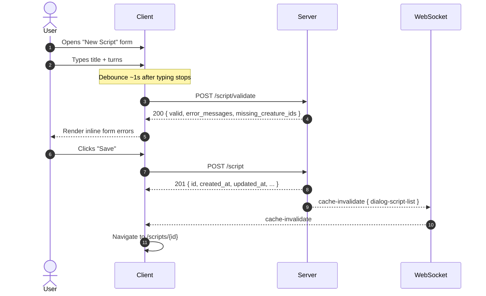
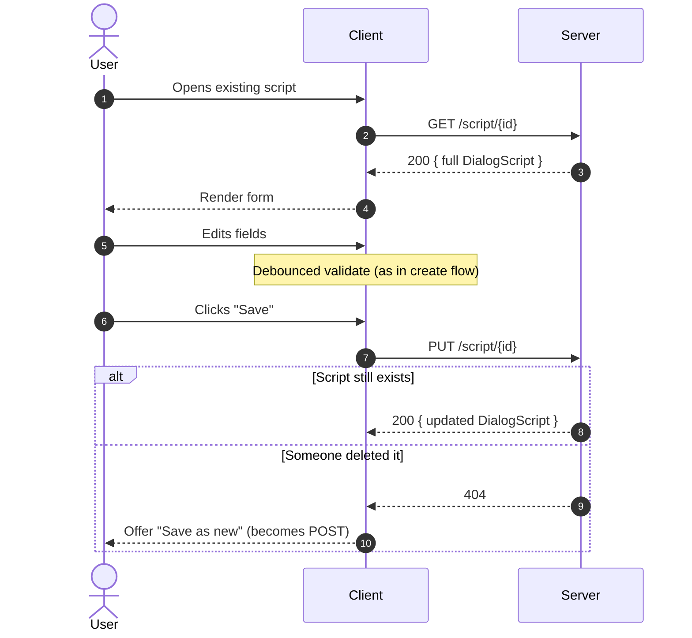
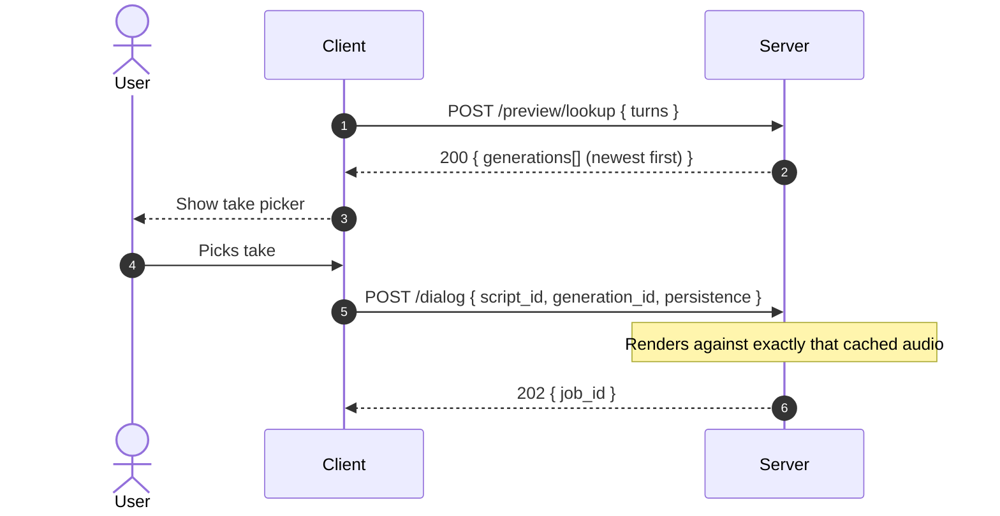
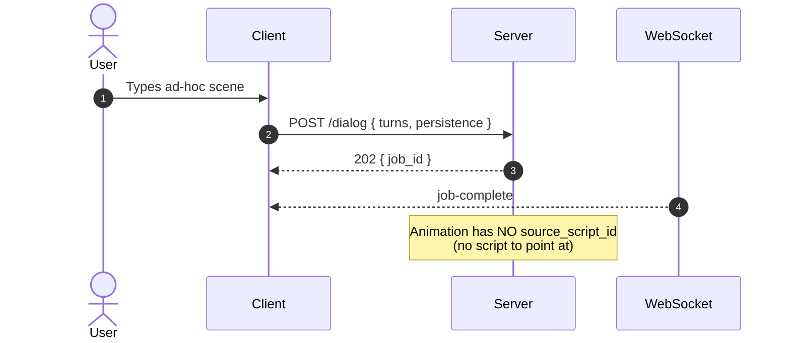

# Multi-Character Dialog — Client Implementation Guide

This doc is for whoever's building the UI on top of the multichar dialog feature (Creature Console, web admin, future tools). It covers the full API surface, the data shapes, and the common workflows. Server version: **3.15.0+**.

> If you're looking for how the server works internally, see `src/server/voice/DialogPipeline.cpp` and `src/server/jobs/JobWorker.cpp::handleDialogJob`. This doc only covers what crosses the network.

---

## What the feature does

A multi-character dialog scene is one block of text where two or more creatures speak in turn. ElevenLabs' Text-to-Dialogue API generates all voices in a single jointly-conditioned audio file (so each creature actually reacts to the one before it, instead of sounding like isolated TTS clips concatenated). The server slices that mixdown into per-creature tracks, runs lip-sync against forced-alignment data, and assembles a multi-track Animation suitable for the 17-channel show.

There are two ways the client can use it:

1. **Inline render** — POST a scene's turns directly, get an Animation back. Good for one-shots and reactive use.
2. **Saved DialogScript** — Create / edit / list / delete named scenes (title + notes + turns) like any other CRUD resource. Render an existing script into an Animation by referencing its `script_id`. Good for show prep, where the author wants to tweak Mango's third line and re-render the next day without retyping.

The rendered Animation, no matter which path produced it, carries a **copy-on-write snapshot** of the turns it was rendered from. So even if you later edit or delete the source script, every animation that was ever rendered from it remembers exactly what was said.

---

## Mental model

```mermaid
flowchart LR
    Script["<b>DialogScript</b><br/><i>editable, persisted</i><br/>• title<br/>• notes<br/>• turns[]<br/>• created_at / updated_at"]
    Inline["<b>Inline turns[]</b><br/><i>POST /dialog body</i>"]
    Render(["POST /dialog<br/>(async job)"])
    Animation["<b>Animation</b><br/><i>immutable render</i><br/>• tracks<br/>• sound_file<br/>• standard metadata"]
    Provenance{{"<b>+ source_script_id</b> &nbsp;<i>(soft pointer)</i><br/><b>+ source_script_turns</b> &nbsp;<i>(CoW snapshot)</i>"}}

    Script -->|script_id| Render
    Inline -->|turns[]| Render
    Render --> Animation
    Script -.copies turns into.-> Provenance
    Provenance -.attached to.-> Animation

    classDef editable fill:#dbeafe,stroke:#1e40af,color:#0f172a
    classDef immutable fill:#dcfce7,stroke:#166534,color:#0f172a
    classDef ephemeral fill:#fef3c7,stroke:#b45309,color:#0f172a
    classDef provenance fill:#f3e8ff,stroke:#7e22ce,color:#0f172a
    class Script editable
    class Animation immutable
    class Inline ephemeral
    class Provenance provenance
```

Edit-then-delete-the-script is fine: the animation's `source_script_turns` snapshot preserves what was said. Resurrecting a deleted script from an animation snapshot is a manual reverse-pass (copy snapshot into a new POST to `/script`).

---

## Endpoints — at a glance

| Verb | Path | Purpose |
|---|---|---|
| `GET` | `/api/v1/animation/dialog/script` | List all saved scripts (newest first by `updated_at`) |
| `GET` | `/api/v1/animation/dialog/script/{id}` | Fetch one script |
| `POST` | `/api/v1/animation/dialog/script` | Create a new script (server stamps `id` + timestamps) |
| `PUT` | `/api/v1/animation/dialog/script/{id}` | Replace a script (preserves `created_at`, bumps `updated_at`) |
| `DELETE` | `/api/v1/animation/dialog/script/{id}` | Delete a script (rendered animations are untouched) |
| `POST` | `/api/v1/animation/dialog/script/validate` | Shape-check a script without saving — for live form validation |
| `POST` | `/api/v1/animation/dialog` | Render a scene as an Animation (async job, returns 202) |
| `POST` | `/api/v1/animation/dialog/preview/meta` | Generate (or load cached) audio; return metadata + URL |
| `GET` | `/api/v1/animation/dialog/preview/audio/{cache_key}/{filename}` | Mono WAV stream for an `<audio>` element |
| `POST` | `/api/v1/animation/dialog/preview/multichannel` | 17-channel WAV bytes (for Audacity inspection) |
| `POST` | `/api/v1/animation/dialog/preview/lookup` | Cheap cache check — what generations exist for these turns? |

Everything is JSON over HTTP. The render endpoint is async — see the [WebSocket](#websocket-events) section.

---

## Data model

### `DialogScriptTurn`

```json
{
  "creature_id": "4754fc0e-1706-11ef-931d-bbb95a696e2e",
  "text": "[sighs] I am now, Mango."
}
```

| Field | Type | Required | Notes |
|---|---|---|---|
| `creature_id` | string (UUID) | yes | Must be the UUID of an existing creature on the server. Validators reject non-UUID-shaped strings before any DB lookup. |
| `text` | string | yes | Spoken text. May contain inline ElevenLabs audio tags like `[whispering]`, `[laughs]`, `[sighs]`, `[deadpan]`, `[excited]`. Tags are stripped before forced alignment but kept as expressive hints to the dialog model. **Max 4096 chars.** |

### `DialogScript`

```json
{
  "id": "a9262b22-f6fe-4918-8a2a-f9ba7b4c49d2",
  "title": "Beaky and Mango — UFO sighting",
  "notes": "First draft, needs a tighter punchline",
  "turns": [
    { "creature_id": "e93b9a7a-1704-11ef-84b9-3b37dddeb225",
      "text": "[excited] Beaky! Beaky! You won't believe what I just saw outside!" },
    { "creature_id": "4754fc0e-1706-11ef-931d-bbb95a696e2e",
      "text": "[skeptical] Mango, if this is about another squirrel, I swear..." }
  ],
  "created_at": 1748579999000,
  "updated_at": 1748580015000
}
```

| Field | Type | Required | Notes |
|---|---|---|---|
| `id` | string (UUID) | server-managed | Stamped on POST; ignored on PUT (URL is authoritative). |
| `title` | string | yes | Human-readable scene name. **Max 256 chars.** |
| `notes` | string | no | Author's own notes. Not shown to the audience. **Max 16 KB.** |
| `turns` | array of `DialogScriptTurn` | yes | Non-empty. **Max 200 turns.** Order matters — speaking order AND ElevenLabs cross-speaker reactivity order. |
| `created_at` | int64 | server-managed | Wall-clock ms since Unix epoch when first persisted. |
| `updated_at` | int64 | server-managed | Wall-clock ms since Unix epoch of the most recent edit. |

### POST / PUT request shape

The canonical, minimal shape POST and PUT accept is just the editable fields:

```json
{
  "title": "Beaky and Mango — UFO sighting",
  "notes": "First draft, needs a tighter punchline",
  "turns": [
    { "creature_id": "e93b9a7a-1704-11ef-84b9-3b37dddeb225", "text": "..." }
  ]
}
```

**Round-tripping a full `DialogScriptDto` is also fine.** As of 3.15.1 the endpoints are lenient: any extra fields the client sends — including `id`, `created_at`, `updated_at` — are silently ignored and overwritten with server-managed values. So you can fetch a script with GET, edit `title`/`notes`/`turns`, and PUT the whole thing back without stripping anything client-side.

(Pre-3.15.1: the endpoints used a strict deserializer that 400'd with `[oatpp::parser::json::mapping::Deserializer::readObject()]: Error. Unknown field`. If you see that, the server is older — upgrade or strip the read-only fields client-side.)

### `DialogScriptValidation` (response from `/validate`)

```json
{
  "valid": false,
  "script_id": "a9262b22-f6fe-4918-8a2a-f9ba7b4c49d2",
  "turn_count": 6,
  "missing_creature_ids": ["bad-creature-id-here"],
  "error_messages": ["turn 'text' is 5000 chars; max 4096"]
}
```

| Field | Type | Notes |
|---|---|---|
| `valid` | bool | `true` if the script would be accepted by an upsert. Soft warnings (missing creature ids) don't flip this. |
| `script_id` | string | Echo of the submitted id if one was present. Empty for create-flow validation. |
| `turn_count` | uint32 | Number of turns in the submission (whether or not it's valid). |
| `missing_creature_ids` | array of strings | UUIDs the submission references that don't currently exist on the server. **Soft warning** — render-time will reject these too, but it's friendlier to flag at edit-time. |
| `error_messages` | array of strings | Hard validation errors. Empty when `valid=true`. |

Always returns HTTP 200 — even for invalid payloads. The shape lets you render inline form errors without try/catch. Only invalid JSON (which can't be parsed at all) shows up as `valid=false` with a single "Invalid JSON: …" message.

### Animation provenance (the CoW snapshot)

When an Animation is rendered from a saved script, its `metadata` carries two extra fields:

```json
{
  "id": "400b47b2-4ab0-462f-8101-c81b5f187452",
  "metadata": {
    "animation_id": "400b47b2-...",
    "title": "Beaky and Mango — UFO sighting",
    "milliseconds_per_frame": 20,
    "number_of_frames": 1228,
    "sound_file": "dialog/...",
    "multitrack_audio": true,
    "source_script_id": "a9262b22-f6fe-4918-8a2a-f9ba7b4c49d2",
    "source_script_turns": [
      { "creature_id": "e93b9a7a-...", "text": "..." },
      { "creature_id": "4754fc0e-...", "text": "..." }
    ]
  },
  "tracks": [ /* ... */ ]
}
```

- `source_script_id` may point to a script that's been deleted. Treat it as a *hint* — fetch the script lazily; show "edit this script" only if the GET returns 200.
- `source_script_turns` is the authoritative record of what the animation was rendered from. Trust this over the script if they ever disagree.

Animations rendered from inline turns (no `script_id` on the original render request) have neither of these fields.

---

## DialogScript CRUD

### List scripts

```bash
curl -sS https://server.example.com/api/v1/animation/dialog/script
```

Response (200):

```json
{
  "count": 3,
  "items": [
    { "id": "...", "title": "...", "notes": "...", "turns": [...], "created_at": ..., "updated_at": ... },
    ...
  ]
}
```

Sorted newest-first by `updated_at` so the editor's list defaults to "what was I just working on?"

### Get one script

```bash
curl -sS https://server.example.com/api/v1/animation/dialog/script/a9262b22-f6fe-4918-8a2a-f9ba7b4c49d2
```

Returns `200` with a full `DialogScript`, or `404` if the id doesn't exist, or `400` if the id isn't UUID-shaped.

### Create a script

```bash
curl -sS -X POST -H 'Content-Type: application/json' \
  https://server.example.com/api/v1/animation/dialog/script \
  -d '{
    "title": "Beaky and Mango — UFO sighting",
    "notes": "First draft",
    "turns": [
      { "creature_id": "e93b9a7a-...", "text": "[excited] Beaky! Beaky!" },
      { "creature_id": "4754fc0e-...", "text": "[skeptical] What now, Mango?" }
    ]
  }'
```

- Returns **`201 Created`** with the full `DialogScript` (including the server-generated `id` and timestamps).
- `400` on shape errors (missing title, empty turns, oversized field, etc.) — message describes which.
- Validates UUID shape of every `creature_id` *eventually* (the validate endpoint warms-warns; the upsert itself doesn't enforce creature existence — render-time does).

### Update a script

```bash
curl -sS -X PUT -H 'Content-Type: application/json' \
  https://server.example.com/api/v1/animation/dialog/script/a9262b22-f6fe-4918-8a2a-f9ba7b4c49d2 \
  -d '{
    "title": "Beaky and Mango — UFO sighting (v2)",
    "notes": "Tightened the punchline",
    "turns": [ ... ]
  }'
```

- Returns `200` with the updated `DialogScript`.
- `created_at` is preserved from the existing record; `updated_at` is bumped to now.
- `404` if no script with that id exists (PUT replaces, never creates-via-id).
- **No optimistic concurrency / ETag yet** — two simultaneous PUTs are last-write-wins. If you need a "scene is being edited" UI lock, build it client-side.

### Delete a script

```bash
curl -sS -X DELETE https://server.example.com/api/v1/animation/dialog/script/a9262b22-f6fe-4918-8a2a-f9ba7b4c49d2
```

Returns:

```json
{ "status": "OK", "code": 200, "message": "DialogScript deleted" }
```

Or `404` if the id doesn't exist.

**Important:** Deleting a script does NOT touch any Animations that were rendered from it. They keep their `source_script_turns` snapshot and remain playable. The `source_script_id` they carry will start 404'ing on GET — that's expected; treat it as a hint, not a hard reference.

### Validate (live form check)

```bash
curl -sS -X POST -H 'Content-Type: application/json' \
  https://server.example.com/api/v1/animation/dialog/script/validate \
  -d '{
    "title": "Test",
    "turns": [
      { "creature_id": "not-a-uuid", "text": "Hi" }
    ]
  }'
```

Response (always 200):

```json
{
  "valid": false,
  "script_id": "",
  "turn_count": 1,
  "missing_creature_ids": [],
  "error_messages": ["turn creature_id is not a UUID: 'not-a-uuid'"]
}
```

Tips for the editor:
- Debounce: don't fire this on every keystroke — once per second of typing inactivity is fine.
- Treat `missing_creature_ids` as a yellow warning ("this creature isn't registered, render will fail"), not a red error.
- The validate endpoint accepts either the bare upsert request shape (no `id`) OR a round-tripped `DialogScript` (with `id` and timestamps). The server stamps a placeholder id if you don't send one.

---

## Rendering a dialog

### Two ways

1. **From a saved script:** pass `script_id`, no `turns`.
2. **Inline:** pass `turns` directly, no `script_id`.

The server rejects requests that provide both (400) or neither (400). Validation happens up-front; the actual render is async.

### Re-rendering a script overwrites in place (3.15.4+)

When `script_id` is set AND `persistence` is `"permanent"`, the server checks for any previously-rendered Animation for this same script (by `metadata.source_script_id` match) and **reuses that Animation's `id` for the new render**. The old document is overwritten in the DB; you do not get a fresh `animation_id` on each render.

What this means for the client:
- Cache by `script_id`, not by `animation_id`, when you want "the current rendering of this script."
- The `animation_id` you got the first time stays valid across re-renders. References to it from playlists / ad-hoc triggers / external links continue to work.
- The CoW snapshot (`metadata.source_script_turns`) is overwritten too — it always reflects the latest render, not all renders ever.
- The `job-complete` payload still carries `animation_id`. On a re-render, it equals the previous render's id; on a first render, it's a fresh UUID.

Scope:
- Inline-turn renders (no `script_id`) → fresh `animation_id` every time. No script to dedupe against.
- AdHoc renders (`persistence: "adhoc"`) → fresh `animation_id` every time. AdHoc has TTL cleanup; clutter is self-limiting.
- Pre-3.15.4 servers always created fresh ids regardless of `script_id`. If you're working with a script that was rendered multiple times against an older server, the first 3.15.4 render picks one of those duplicates (whichever Mongo returns first) and reuses its id; subsequent renders are stable.

### Request shape — `DialogRequest`

```json
{
  "turns": [
    { "creature_id": "e93b9a7a-...", "text": "[excited] Beaky!" },
    { "creature_id": "4754fc0e-...", "text": "[sighs] What is it, Mango?" }
  ],
  "script_id": null,
  "persistence": "permanent",
  "autoplay": false,
  "title": "Optional title for the rendered animation",
  "generation_id": null
}
```

| Field | Type | Required | Notes |
|---|---|---|---|
| `turns` | array of `DialogTurn` | XOR with `script_id` | Inline scene. Max 200 turns / 4 KB per text. |
| `script_id` | string (UUID) | XOR with `turns` | UUID of a saved DialogScript. Render uses the script's turns at the moment of POST (CoW snapshot is then captured onto the Animation). |
| `persistence` | string | yes | `"adhoc"` or `"permanent"`. Ad-hoc goes to a TTL collection (cron-cleaned); permanent goes to the main animations collection. |
| `autoplay` | bool | no | If true, also call `SessionManager::interrupt()` to play immediately. Requires all creatures to be registered on the same universe. Defaults to false. |
| `title` | string | no | Stored in animation metadata. Defaults to `"Dialog {job_id}"`. |
| `generation_id` | string (UUID) | no | Use a specific previously-cached ElevenLabs generation. If unset, server reuses the latest cached take or generates fresh. |

### Response

```json
{
  "job_id": "6990a103-8f0f-4f79-9395-ff2ee67dcc2a",
  "job_type": "dialog",
  "message": "Dialog job created with 2 turn(s). Listen for job-progress and job-complete WebSocket messages on this job_id."
}
```

HTTP **`202 Accepted`**. The job runs asynchronously; subscribe to the WebSocket and filter on this `job_id`.

### Common request errors (HTTP 400)

| Message | What went wrong |
|---|---|
| `request body required` | Empty body |
| `provide either turns or script_id, not both` | Both fields populated |
| `turns must be a non-empty array (or provide script_id to render a saved script)` | Neither populated |
| `script_id must be a UUID` | Non-UUID-shaped `script_id` |
| `persistence must be 'adhoc' or 'permanent'` | Missing or invalid `persistence` |
| `turns has N entries; max 200` | Oversized inline scene |
| `turn 'text' is N chars; max 4096` | Oversized per-turn text |
| `every turn must have a non-empty creature_id and text` | Missing fields in a turn |

---

## Preview (listen before committing)

Three endpoints, all reading from the same per-input ElevenLabs generation cache so flipping between them is free after the first hit.

The **cache key** is `sha256(turns)`. The **generation_id** is a UUID for one specific ElevenLabs take. Same input + multiple `regenerate=true` calls → same `cache_key`, different `generation_id`s. The cache stores all generations and lets you flip between them.

### `POST /preview/meta` — metadata + audio URL

```bash
curl -sS -X POST -H 'Content-Type: application/json' \
  https://server.example.com/api/v1/animation/dialog/preview/meta \
  -d '{
    "turns": [
      { "creature_id": "e93b9a7a-...", "text": "[excited] Beaky!" },
      { "creature_id": "4754fc0e-...", "text": "[sighs] What is it?" }
    ]
  }'
```

Optional fields on the request body:
- `generation_id`: return that specific cached take (404 if expired)
- `regenerate`: if true, ignore the cache and create a fresh generation

Response:

```json
{
  "cache_key": "6bbb1ff65cbb8f33...",
  "generation_id": "a9262b22-f6fe-4918-8a2a-f9ba7b4c49d2",
  "cached": false,
  "audio_url": "/api/v1/animation/dialog/preview/audio/6bbb1ff6.../a9262b22-...wav",
  "audio_format": "pcm_48000",
  "sample_rate": 48000,
  "duration_seconds": 24.56,
  "voice_segments": [
    { "voice_id": "...", "character_start_index": 0, "character_end_index": 28, "dialog_input_index": 0 }
  ],
  "forced_alignment_words": [
    { "text": "Beaky", "start": 0.12, "end": 0.48 },
    ...
  ],
  "forced_alignment_chars": [ /* per-character timing including spaces */ ],
  "forced_alignment_loss": 0.07
}
```

Drop `audio_url` into an `<audio src="...">` element. The mono PCM is wrapped in a 44-byte WAV header on the fly. Use `forced_alignment_words` to highlight the currently-spoken word in a scrubber UI; `voice_segments` tells you which speaker each character range belongs to.

### `GET /preview/audio/{cache_key}/{filename}` — the WAV bytes

You usually don't construct this URL yourself — use the `audio_url` from `/meta`. But if you need to:

- `cache_key` is the hex sha256 from `/meta`
- `filename` is the `generation_id` with an optional `.wav` suffix (the server strips it server-side; the suffix is just so browsers do the right Content-Type sniffing on download)

Returns `audio/wav`, 48 kHz mono S16 PCM in a standard WAV container. 404 if the generation has been cron-swept.

### `POST /preview/multichannel` — 17-channel WAV for Audacity

Same request body as `/preview/meta`. Returns `audio/wav` bytes — a full 17-channel S16 LE @ 48 kHz WAV with each creature's PCM in its `audio_channel` lane (1-based; channel 17 is BGM, unused for dialog). All other lanes are silent.

Headers on the response:
- `X-Dialog-Cache-Key`
- `X-Dialog-Generation-Id`
- `X-Dialog-Cached`: `"true"` or `"false"`

Reuses any cached generation from `/meta` calls with the same input — only the per-creature slicing + 17-channel assembly runs each time.

### `POST /preview/lookup` — what's cached?

Cheap query. No audio work happens. Use this to badge the "Render" button as fast (cached) vs slow (will hit ElevenLabs).

```bash
curl -sS -X POST -H 'Content-Type: application/json' \
  https://server.example.com/api/v1/animation/dialog/preview/lookup \
  -d '{ "turns": [...] }'
```

Returns `200` with all cached generations newest-first, or `404` if nothing is cached for those turns:

```json
{
  "cache_key": "6bbb1ff6...",
  "latest_generation_id": "a9262b22-...",
  "generations": [
    { "generation_id": "a9262b22-...", "created_at": "2026-05-29T07:01:23Z" },
    { "generation_id": "8c103a02-...", "created_at": "2026-05-29T06:58:11Z" }
  ]
}
```

---

## WebSocket events

The server publishes async updates over the existing WebSocket endpoint (`wss://<host>/api/v1/websocket`). For dialog jobs, the relevant events are:

### `job-progress`

```json
{
  "command": "job-progress",
  "payload": {
    "job_id": "6990a103-...",
    "job_type": "dialog",
    "status": "running",
    "progress": 0.55,
    "details": "{...serialized DialogRequest...}"
  }
}
```

`progress` is a float in `[0.0, 1.0]`. Approximate milestones:

| Progress | Milestone |
|---|---|
| `0.05` | Job accepted, request parsed |
| `0.55` | ElevenLabs returned audio |
| `0.60` | Forced alignment done |
| `0.70` | Per-creature slicing in progress |
| `0.85` | Multi-track assembly done |
| `0.95` | Animation persisted |
| `1.00` | Complete (job-complete event) |

### `job-complete`

```json
{
  "command": "job-complete",
  "payload": {
    "job_id": "6990a103-...",
    "job_type": "dialog",
    "status": "completed",
    "result": "{\"animation_id\":\"400b47b2-...\",\"number_of_frames\":1228,\"milliseconds_per_frame\":20,\"duration_seconds\":24.56,\"persistence\":\"permanent\",\"autoplayed\":false}",
    "details": "..."
  }
}
```

`result` is a JSON string (not nested object — the job framework's `result` field is `String`). Parse it for the `animation_id` you just rendered.

### `job-failed` / `job-error`

Same payload shape; `status` is `"failed"` or `"error"`, and `result` contains the error message. Show the user something actionable; the message strings are designed to be user-readable.

### Implementation note

The job system is push-only — there is **no** `GET /api/v1/jobs/{id}` polling endpoint. If the client misses the websocket window (lost connection, reload during render), it has to rediscover the rendered Animation by listing `/api/v1/animation` and filtering for the right title/timestamp. This is a known papercut; if it becomes a real problem, a "job state by id" lookup endpoint is the answer.

---

## Cache invalidation

Whenever the server changes data, it broadcasts a `cache-invalidate` WebSocket message so clients know to refetch:

```json
{ "command": "cache-invalidate", "payload": { "cache_type": "dialog-script-list" } }
```

`cache_type` values you'll see for this feature:

| Value | When it fires | What to refetch |
|---|---|---|
| `dialog-script-list` | After POST/PUT/DELETE on `/script` | The script list (and any open scripts that might have been edited in another tab) |
| `animation` | After a permanent dialog render finishes | The main animations list |
| `sound-list` | After a permanent dialog render finishes | The sound files list |
| `ad-hoc-animation-list` | After an ad-hoc dialog render finishes | The ad-hoc animations list |
| `ad-hoc-sound-list` | After an ad-hoc dialog render finishes | The ad-hoc sounds list |

There's a 50ms delay before invalidation broadcasts go out, which lets the DB write settle so the refetch sees the new state. Don't worry about race conditions.

---

## Validation limits — the single source of truth

These constants live in `src/model/DialogScript.h` server-side. Match them client-side for parity (so the form validates the same way the API does):

```
MAX_DIALOG_SCRIPT_TURNS     = 200
MAX_DIALOG_SCRIPT_TURN_TEXT = 4096   // chars
MAX_DIALOG_SCRIPT_TITLE     = 256    // chars
MAX_DIALOG_SCRIPT_NOTES     = 16384  // chars
```

These caps apply to **both** the saved-script path and the inline-render path. The validate endpoint is the friendliest way to surface them; the upsert + render endpoints return 400 with a specific "X is N chars; max M" message.

---

## Common workflows

### Script editor — create flow



### Script editor — edit flow



### Listen-before-render

```mermaid
sequenceDiagram
    autonumber
    actor User
    participant Client
    participant Server
    participant EL as ElevenLabs
    participant WS as WebSocket

    User->>Client: Has a draft (saved or not)
    Client->>Server: POST /preview/meta
    alt First time for these turns
        Server->>EL: Generate audio
        EL-->>Server: PCM audio
        Server->>Server: Cache by sha256(turns)
    else Cached
        Note over Server: cache hit, no ElevenLabs call
    end
    Server-->>Client: 200 { audio_url, generation_id, voice_segments, ... }
    Client->>Server: GET audio_url
    Server-->>Client: audio/wav (mono S16 @ 48 kHz)
    Client-->>User: Plays in &lt;audio&gt; element

    opt User wants a different take
        User->>Client: "Try again"
        Client->>Server: POST /preview/meta { regenerate: true }
        Note over Server: New generation_id, same cache_key
    end

    User->>Client: "Render this take"
    Client->>Server: POST /dialog { script_id OR turns, generation_id, persistence }
    Server-->>Client: 202 { job_id }
    Client->>WS: Subscribe, filter by job_id
    WS-->>Client: job-progress (×N)
    WS-->>Client: job-complete { result.animation_id }
    Client->>Client: Navigate to /animations/{animation_id}
```

The preview cache means going back to "listen again" or "render this exact take" never re-spends ElevenLabs credits — the meta `generation_id` is what guarantees you render the audio you just liked.

### Render with a specific take



### Inline render (no script saved)



The resulting Animation will have NO `source_script_id` / `source_script_turns` — there's no script to point at. If the user later wants to edit + re-render, they'll have to retype the scene. (This is why the script-save path exists.)

---

## What the client doesn't need to worry about

- **Where audio files live.** The Animation's `metadata.sound_file` is a server-relative path; the sound API knows how to serve it.
- **17-channel WAV format details.** The server enforces 48k/S16/17-channel hard contract — your client never deals with raw audio bytes for playback (the player consumes the standard sound-file URL).
- **Per-creature channel assignments.** The server reads `audio_channel` from each creature's config and lays out the multichannel WAV accordingly. Client only references `creature_id`.
- **ElevenLabs API directly.** All voice generation is server-side; the client never sees an ElevenLabs URL or API key.
- **Cache TTLs.** Preview generations get cron-cleaned (default ~12 hours). Treat any cached `generation_id` as possibly-expired; the server returns 404 if it's gone.

---

## Quick reference — gotchas

- **`creature_id` MUST be a UUID** — every validator from the controller down rejects non-UUID-shaped strings. There's no fallback to "name" or "slug" lookup.
- **`persistence` is required** on `POST /dialog` — there's no default; missing it is a 400.
- **`turns` XOR `script_id`** — providing both, or neither, is a 400.
- **Inline tags are spoken-data, not metadata.** `[whispering]` is part of the `text` field. The server strips them for forced alignment but feeds them to ElevenLabs as-is.
- **Mongo `_id` is NOT the script id.** The server stamps its own UUID into the `id` field; the `_id` is internal.
- **No batch / multi-script endpoints.** If you need to render 12 scripts overnight, fire 12 sequential POSTs and watch 12 job_ids. The job system handles parallelism internally.
- **No "live edit + auto-rerender".** Updating a script doesn't re-render any animations. Each render is explicit.

---

## Versions

| Server | What changed |
|---|---|
| 3.14.0 | Multichar dialog feature shipped (inline turns only) |
| 3.14.1–3.14.4 | Bug fixes during e2e (forced-alignment whitespace, preview URL pattern, mouth_slot validation, buildNeutralFrame bounds) |
| 3.15.0 | DialogScript CRUD + `script_id` render path + CoW snapshot + validate endpoint |
| 3.15.1 | Lenient POST/PUT — accepts round-tripped `DialogScriptDto`; friendly field-level validation errors instead of oatpp internals |
| 3.15.2 | VERSION extracted to `VERSION.txt` so version bumps don't bust the GHA dep cache (closes issue #18). No client-visible behavior change. |
| 3.15.3 | Dialog silence-fill uses the speech_loop's first frame instead of a computed neutral pose — fixes inverted-motor bug where listening creatures held the wrong rest pose |
| **3.15.4** | **Re-rendering a script with `persistence: permanent` overwrites the existing animation in place (stable `animation_id` across re-renders).** |
